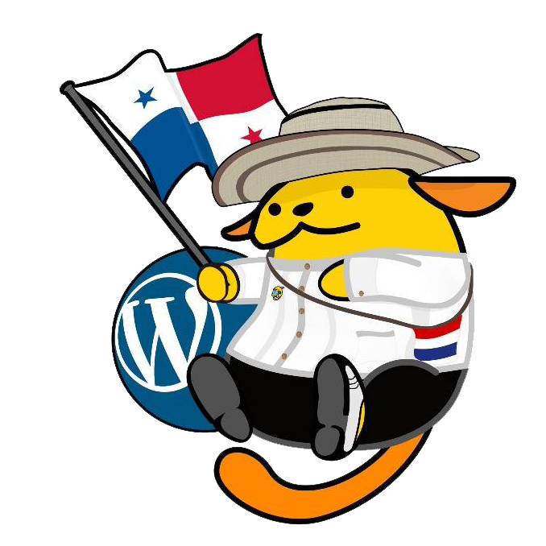
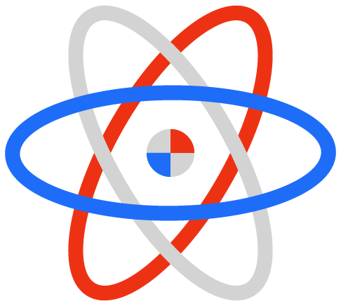

# Comunidades a las que Pertenezco

Tengo la gran oportunidad de formar parte de varias comunidades en la ciudad de Panamá. Las comunidades más importantes son:

## Comunidad de WordPress de la Ciudad de Panamá

La comunidad de WordPress de la Ciudad de Panamá fue fundada y es liderada por [Ernesto Morales](https://www.linkedin.com/in/ernestomorales/) en el año 2018 para reunir a los usuarios del sistema y compartir conocimientos. El primer meetup se dio en las oficinas de [Global Internet](https://globalinternet.com.pa/) el 20 de Octubre de 2018 y fui la primera persona en asistir, además de los anfitriones Ernesto Morales y [Neztor Aconcha](https://www.linkedin.com/in/neztorweb/). Desde ese entonces he formado parte de la comunidad como organizador de eventos tan importantes como el primer WordCamp de la Ciudad de Panamá en el año 2019 hasta organizar encuentros y dar charlas a los miembros de la comunidad. La comunidad de WordPress ha crecido desde tres miembros hasta más de 600 al día de hoy. Es una de las comunidades más importantes de la Ciudad y sigue creciendo.

## Style Leading

  

La Comunidad de StyleLeading es una comunidad nueva fundada por [Jair Manuel Poveda](https://www.linkedin.com/in/jairpoveda/) fundador de la agencia de desarrollo web [Cooltimedia](https://cooltimedia.com/). Esta comunidad fue fundada a principios del año 2020 y se dedica a fomentar el uso y la práctica de las tecnologías fundamentales de la web, como HTML, CSS y JavaScript vainilla. Participo muy activamente en esta comunidad ya que creo mucho en el trabajo de esta y espero ser parte importante de la misma inspirando a las personas a adoptar estas tecnologías y utilizarlas en su ámbito profesional.

## React Panamá

La comunidad de React Panamá es una comunidad muy joven, fundada por mi persona y Ernesto Morales. La misión de esta comunidad es compartir conocimientos de esta tecnología que ha crecido y es de gran importancia para la creación de interfaces de usuario, al igual que conocernos y compartir ideas. Empezó en Marzo de 2020 y como una comunidad pequeña pero ha crecido con mucha aceptación. Nuestra meta es formar parte de la comunidad de React internacional empezando con la comunidad de Colombia, y promocionar a la ciudad como un centro de interés y conocimiento por la tecnología.
