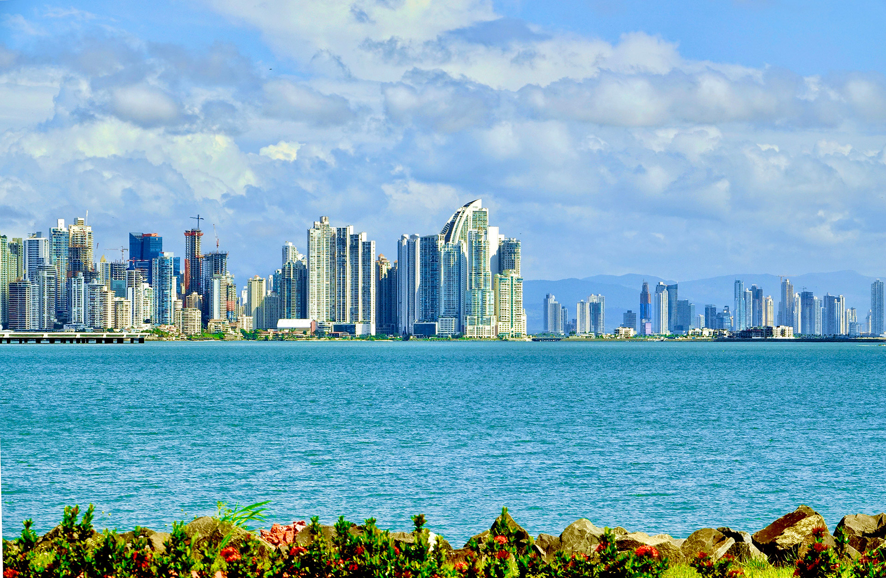

import { Link } from "gatsby"

# Soy Diseñador y Desarrollador de Aplicaciones Web

Mi nombre es _Juan Moisés Torrijos_ y soy **diseñador y programador** de **sitios y aplicaciones** para la web.

Vivo en la _Ciudad de Panamá_ 🇵🇦 trabajando en una empresa [marítima internacional](https://intermaritime.org/) como encargado de tecnología. Soy el fundador de una [empresa de diseño y desarrollo de sitios y aplicaciones web y móviles](https://digiartes.com). En mi tiempo libre escribo en mi blog, ayudo a empresas locales e internacionales a crear su presencia en la web, creo aplicaciones web y comparto mis conocimientos con mis colegas en diferentes <Link to="/acerca/comunidades">grupos locales de tecnología</Link>.

  

Empecé mi carrera en el 2009, creando sitios web personalizados para todo tipo de clientes. Desde clínicas especializadas, escuelas de artes marciales, tiendas locales y empresas de construcción. Hoy en día me dedico a compartir mis conocimientos, escribir sobre tecnología y seguir creando sitios web.

Con mi experiencia he adquirido muchas vivencias de lado de empresarios y emprendedores, quienes me han inspirado y abierto la mente para lograr nuevas metas. Soy padre de dos bellas niñas y esposo de una hermosa y cariñosa mujer, quien me acompaña en mi peregrinaje profesional. Estudié Ingeniería en la Universidad Estatal de Louisiana (Louisiana State University) y mi bachillerato en el Colegio San Agustín.

Si estás buscando un profesional con vasta experiencia en sitios y aplicaciones web contáctame. Estoy disponible para trabajar, me puedes <Link to="/contactame">contactar aquí</Link>