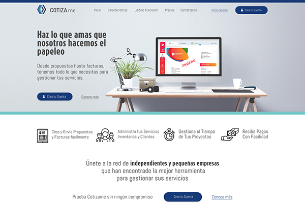
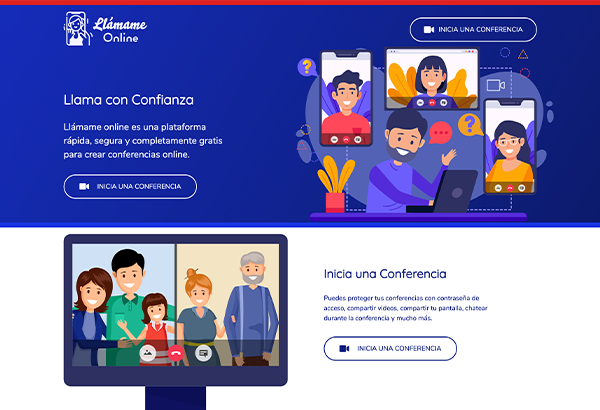

import { Link } from 'gatsby';

# Mis Proyectos Personales

A continuación hablaré de algunos proyectos personales en los cuales estoy trabajando o he trabajado. Estos proyectos han sido inspiración propia basado en las necesidades de algunos clientes y colaboradores. Todos son de mi propia creación y están protegidos bajo mi propiedad intelectual. Si te gustaría conocer más de ellos o formar parte de uno de ellos o inclusive invertir tus recursos no dudes en <Link to="/contactame">contactarme aquí</Link>.

## Cotiza.me

  

Es un proyecto para ayudar a los independientes y pequeños negocios a crear y enviar cotizaciones y facturas, y recibir pagos por internet con facilidad. También permite llevar un control de los servicios y productos que vende, y crear inventarios. Adicionalmente permite tener un sitio para gestionar los contactos y relaciones con los clientes. Finalmente permite administrar proyectos y tareas. Es una aplicación que aún está en desarrollo y espero finalizar en el 2020. Puedes conocer más de ella en <a href="https://cotiza.me">Cotiza.me</a>. 

## Llámame Online

  

Llámame Online es un proyecto de mi amigo Roberto Rubio para su empresa <a href="https://servidoresrapidos.net">ServidoresRapidos.net</a>. Está basado en una plataforma gratuita y de código abierto para hacer llamadas y conferencias en línea llamada Jitsi Meet. Está instalado en un servidor dentro de ServidoresRapidos.net y la plantilla fue personalizada por mi. Igualmente participé en la página de inicio (landing page) del sitio. El producto es gratuito, pero tiene una versión de pago el cual incluye la posibilidad de tener tu propio software de video conferencias (a la Zoom) pero con tu propia marca y nombre. Puedes conocer más del proyecto en <a href="https://llamame.online">Llamame.Online</a>.
